# Author: Dongyou James Seo
Linkedin: https://www.linkedin.com/in/dongyou-james-seo

# URL-Monitoring
A simple python webserver (exporter) which collects availability and response time for each target URL.

## REST API
| HTTP method | Path | Description |
|-------------|------|-------------|
| GET | /metrics | Collect availability, UP(1) or DOWN(0), and response time(ms) for each target URL and return Prometheus format output|

In the below example, the target URL == [https://httpstat.us/503, https://httpstat.us/200] and each URL has 2 prometheus outputs, **sample_external_url__up** and **sample_external_url__response_ms**.  
```BASH
sample_external_url__up{url="https://httpstat.us/503"} 0.0
sample_external_url__response_ms{url="https://httpstat.us/503"} 155.116
sample_external_url__up{url="https://httpstat.us/200"} 1.0
sample_external_url__response_ms{url="https://httpstat.us/200"} 93.34
```

## Prerequisites
Need to prepare the below prerequisites before start.
1. python3
2. jsonnet
3. docker
4. kubectl + any Kubernetes cluster access \
**NOTE**: In this description, I set up a local v1.18.8 Kubernetes cluster.
5. pip packages
```BASH
pip install -r requirements.txt
```

## Unittest
They simply verifies classes one by one locally without generating any external traffic.

| Test case | Description |
|------|-------------|
| test_collector.py | Start a mock web server and verify if **Collector** class can generate prometheus outputs accessing the mock server |
| test_config.py | Verify if **Config** loads TARGET_URLs from **config.json** |
| test_http_connector.py | Start a mock web server and verify if **HttpConnector** returns HTTP status and response time(ms) accessing the mock server |
| test_logger.py | Verify if Singleton **Logger** is instantiated. |

### How to run unittests
```BASH
python -m unittest discover -v
test_collectFromWrongURL (test.test_collector.TestCollector) ... 2020-10-23 23:23:07,296         [DEBUG | http_connector.py:21] > GET http://localhost:9999/404
127.0.0.1 - - [23/Oct/2020 23:23:09] "GET /404 HTTP/1.1" 404 -
ok
/Library/Developer/CommandLineTools/Library/Frameworks/Python3.framework/Versions/3.7/lib/python3.7/unittest/suite.py:107: ResourceWarning: unclosed <socket.socket fd=4, family=AddressFamily.AF_INET, type=SocketKind.SOCK_STREAM, proto=0, laddr=('127.0.0.1', 9999)>
  for index, test in enumerate(self):
ResourceWarning: Enable tracemalloc to get the object allocation traceback
test_collectSuccessfully (test.test_collector.TestCollector) ... 2020-10-23 23:23:09,830         [DEBUG | http_connector.py:21] > GET http://localhost:9999/200
127.0.0.1 - - [23/Oct/2020 23:23:11] "GET /200 HTTP/1.1" 200 -
2020-10-23 23:23:11,834          [DEBUG | collector.py:35] > HTTP Status (200) and elapsedTime (2003.399 ms) 
2020-10-23 23:23:11,835          [DEBUG | collector.py:49] > Collecting done
2020-10-23 23:23:11,835          [DEBUG | http_connector.py:21] > GET http://localhost:9999/503
127.0.0.1 - - [23/Oct/2020 23:23:13] "GET /503 HTTP/1.1" 503 -
2020-10-23 23:23:13,842          [DEBUG | collector.py:35] > HTTP Status (503) and elapsedTime (2005.507 ms) 
2020-10-23 23:23:13,842          [DEBUG | collector.py:49] > Collecting done
ok
/Library/Developer/CommandLineTools/Library/Frameworks/Python3.framework/Versions/3.7/lib/python3.7/unittest/suite.py:84: ResourceWarning: unclosed <socket.socket fd=4, family=AddressFamily.AF_INET, type=SocketKind.SOCK_STREAM, proto=0, laddr=('127.0.0.1', 9999)>
  return self.run(*args, **kwds)
ResourceWarning: Enable tracemalloc to get the object allocation traceback
test_getTargets (test.test_config.TestConfig) ... ok
testAccessToMockserver (test.test_http_connector.TestHttpConnector) ... 2020-10-23 23:23:14,344          [DEBUG | http_connector.py:21] > GET http://localhost:9999/200
127.0.0.1 - - [23/Oct/2020 23:23:15] "GET /200 HTTP/1.1" 200 -
2020-10-23 23:23:15,352          [DEBUG | http_connector.py:21] > GET http://localhost:9999/503
127.0.0.1 - - [23/Oct/2020 23:23:16] "GET /503 HTTP/1.1" 503 -
ok
test_getLogger (test.test_logger.TestUtils) ... ok

----------------------------------------------------------------------
Ran 5 tests in 9.578s

OK
```

## How to locally run urlmon for debug purpose
1. Prepare config.json
```JSON
{
	"TARGETS": [
	    "<any URL1 like https://httpstat.us/503>",
	    "<any URL2 like https://httpstat.us/200>",
        ...
    ]
}
```
2. Export CONFIG_PATH pointing to the config.json
```BASH
export CONFIG_PATH=config.json
```

3. Run main python file
```BASH
python src/url_mon.py <target port> 

In different terminal, 
curl -XGET http://localhost:8080/metrics

For example,
python src/url_mon.py 8080
2020-10-23 21:49:09,055          [INFO | url_mon.py:53] > Serving on port 8080...
2020-10-23 21:49:17,458          [INFO | url_mon.py:25] > Start collecting metrics
2020-10-23 21:49:17,459          [DEBUG | http_connector.py:23] > GET https://httpstat.us/503
2020-10-23 21:49:17,592          [DEBUG | collector.py:35] > HTTP Status (503) and elapsedTime (119.098 ms) 
2020-10-23 21:49:17,593          [DEBUG | collector.py:49] > Collecting done
2020-10-23 21:49:17,593          [DEBUG | http_connector.py:23] > GET https://httpstat.us/200
2020-10-23 21:49:17,736          [DEBUG | collector.py:35] > HTTP Status (200) and elapsedTime (137.867 ms) 
2020-10-23 21:49:17,736          [DEBUG | collector.py:49] > Collecting done
2020-10-23 21:49:17,736          [DEBUG | url_mon.py:43] > Successfully collected [b'# HELP sample_external_url__up Availability, UP or DOWN\n# TYPE sample_external_url__up gauge\nsample_external_url__up{url="https://httpstat.us/503"} 0.0\n# HELP sample_external_url__response_ms Elapsed Time(MS)\n# TYPE sample_external_url__response_ms gauge\nsample_external_url__response_ms{url="https://httpstat.us/503"} 119.098\n', b'# HELP sample_external_url__up Availability, UP or DOWN\n# TYPE sample_external_url__up gauge\nsample_external_url__up{url="https://httpstat.us/200"} 1.0\n# HELP sample_external_url__response_ms Elapsed Time(MS)\n# TYPE sample_external_url__response_ms gauge\nsample_external_url__response_ms{url="https://httpstat.us/200"} 137.867\n']
127.0.0.1 - - [23/Oct/2020 21:49:17] "GET /metrics HTTP/1.1" 200 654
``` 

## How to build docker image
```BASH
docker buld -t <imageName>:<any tag> ./

For example, 
docker build -t solver1318/test-image-42:vmware ./
Sending build context to Docker daemon  16.15MB
Step 1/5 : FROM python:3.7-slim
 ---> 217e85391449
Step 2/5 : WORKDIR /app
 ---> Using cache
 ---> 09c6ebf72cda
Step 3/5 : COPY src/ .
 ---> Using cache
 ---> 91dad9105ea9
Step 4/5 : COPY requirements.txt .
 ---> Using cache
 ---> 6cf40818a4e8
Step 5/5 : RUN pip install -r requirements.txt
 ---> Using cache
 ---> 65dafa3bc2c9
Successfully built 65dafa3bc2c9
Successfully tagged solver1318/test-image-42:vmware
```
If you want to push the image into docker hub registry and use it in a real Kubernetes cluster. You need to publish it after login.
```BASH
docker login
docker tag <imageName>:<any tag> <your account name>/<imageName>:<any tag>
docker push <your account name>/<imageName>:<any tag>
```
Or you can simply pull and use the uploaded image.
```BASH
docker pull solver1318/test-image-42:vmware
```

## How to generate Kubernetes manifest
To generate the manifest, we need to define the below inputs in **Jsonnet** command to dynamically template.
1. target namespace
2. number of replicas of urlmon pods
3. target port number
4. image built in **How to build docker image** section like \<imageName\>:\<any tag\>
```BASH
jsonnet urlmon.jsonnet --ext-str namespace=<namespace> --ext-str replicas=<number of replicas> --ext-str port=<target port number> --ext-str image=<the image> > <k8s manifest name>.json

For example,
jsonnet urlmon.jsonnet --ext-str namespace=url-monitoring --ext-str replicas=1 --ext-str port=8080 --ext-str image=solver1318/test-image-42:vmware > k8s.json
```
After the Jsonnet command, you will get a Kubernetes JSON Manifest, [sample](https://github.com/solver1318/url_monitor/blob/main/k8s/sample_k8s_by_jsonnet.json).

## Kubernetes Resources
The Kubernetes Manifest includes the below 5 resources.
| Resource Type| Name | Description |
|--------------|-------------|-------------|
| Namespace | Whatever you want | Your target namespace |
| Deployment | urlmon | urlmon backend pod(s) |
| Service | urlmon-service | Kubernetes internal load balancer and redirect traffics to urlmon pod(s) based on LB policy |
| ConfigMap | urlmon-config | Included config.json which includes target URLs |
| CronJob | client-job | Client Cronjob which accesses to http://urlmon-service:8080/metrics every 1min and receives the metrics for testing (Integration Test) |

**NOTE**: One design intent is that we can modify target URL list on the fly by editing **urlmon-config** Config map.
```BASH
apiVersion: v1
data:
  config.json: |
    {"TARGETS": ["https://httpstat.us/503", "https://httpstat.us/200", "https://www.vmware.com"]} # https://www.vmware.com appended
```

## How to deploy
```BASH
kubectl apply -f <k8s manifest JSON file path>

For example,
kubectl apply -f k8s.json
namespace/url-monitoring created
deployment.apps/urlmon created
service/urlmon-service created
configmap/urlmon-config created
cronjob.batch/client-job created

kubectl get pods -n url-monitoring
NAME                          READY   STATUS      RESTARTS   AGE
client-job-1603644420-bjvj8   0/1     Completed   0          9s
urlmon-64c99b957f-6hfl7       1/1     Running     0          58s
urlmon-64c99b957f-bdg99       1/1     Running     0          58s

```

## Response of GET /metrics
```BASH
kubectl logs -f client-job-1603644420-bjvj8 -n url-monitoring
# HELP sample_external_url__up Availability, UP or DOWN
# TYPE sample_external_url__up gauge
sample_external_url__up{url="https://httpstat.us/503"} 0.0
# HELP sample_external_url__response_ms Elapsed Time(MS)
# TYPE sample_external_url__response_ms gauge
sample_external_url__response_ms{url="https://httpstat.us/503"} 136.144
# HELP sample_external_url__up Availability, UP or DOWN
# TYPE sample_external_url__up gauge
sample_external_url__up{url="https://httpstat.us/200"} 1.0
# HELP sample_external_url__response_ms Elapsed Time(MS)
# TYPE sample_external_url__response_ms gauge
sample_external_url__response_ms{url="https://httpstat.us/200"} 130.102
```

# Prometheus Integration
## How to install Prometheus through Helm
```BASH
helm repo add stable https://kubernetes-charts.storage.googleapis.com
helm repo update
helm install prometheus stable/prometheus -n <target namespace>

For example,
kubectl get pods -n url-monitoring
NAME                                            READY   STATUS      RESTARTS   AGE
client-job-1603513200-9d7m4                     0/1     Completed   0          4m54s
client-job-1603513260-sv8zq                     0/1     Completed   0          3m54s
client-job-1603513320-vvsn9                     0/1     Completed   0          2m53s
client-job-1603513380-rbjsd                     0/1     Completed   0          113s
client-job-1603513440-k7wwf                     0/1     Completed   0          53s
prometheus-alertmanager-6b64586d49-xtwbs        2/2     Running     0          9m2s
prometheus-kube-state-metrics-c65b87574-4567g   1/1     Running     0          38m
prometheus-node-exporter-btwbj                  1/1     Running     0          38m
prometheus-pushgateway-7d5f5746c7-mqzb6         1/1     Running     0          9m1s
prometheus-server-f8d46859b-t2mnv               2/2     Running     0          7m58s
urlmon-64c99b957f-nbktx                         1/1     Running     0          2m11s
```

## How to access Prometheus Alert Manger console
Execute port-forward to connect Prometheus from local to Kubernetes cluster 
```BAsh
export POD_NAME=$(kubectl get pods -n <target namespace> -l "app=prometheus,component=server" -o jsonpath="{.items[0].metadata.name}")
kubectl port-forward $POD_NAME 9090 -n <target namespace>
Forwarding from 127.0.0.1:9090 -> 9090
Forwarding from [::1]:9090 -> 9090
```
Open http://localhost:9090 in your browser 
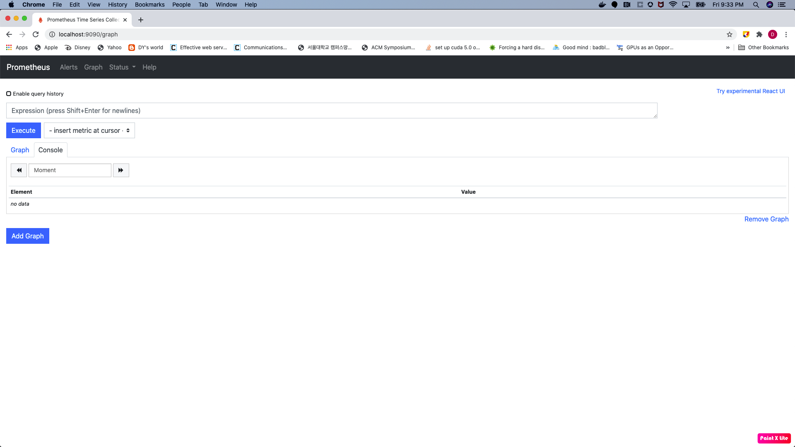

## How to integrate urlmon's GET /metrics API with Prometheus
Update prometheus-server configMap using kubectl edit
```BASH
kubectl edit cm prometheus-server -n <target namespace>
...
    - job_name: prometheus
      static_configs:
      - targets:
        - localhost:9090
    - job_name: url-monitoring # Append url-monitoring job
      static_configs:
      - targets:
        - urlmon-service:8080 # urlmon Service and port number
...
```
Check if url-monitoring is added in Prometheus target
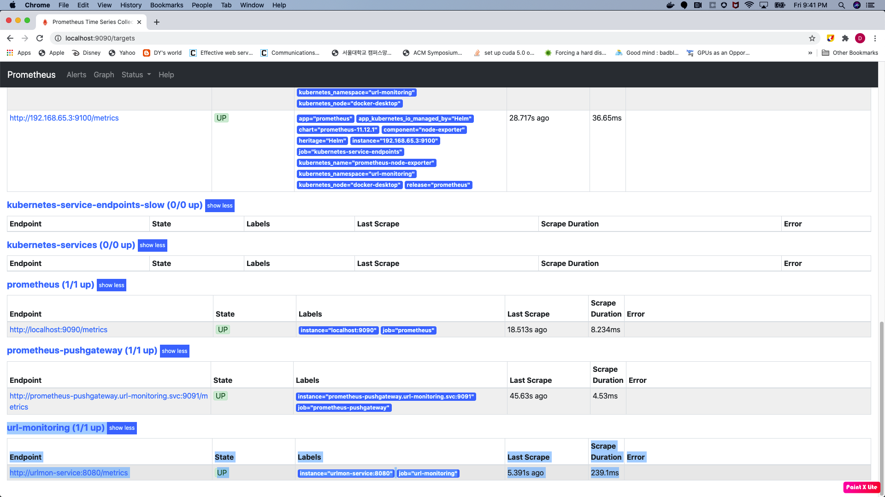

Check if **sample_external_url__up** and **sample_external_url__response_ms** are added as Graph like this:
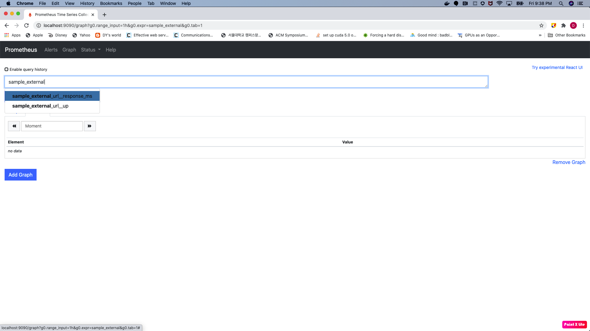
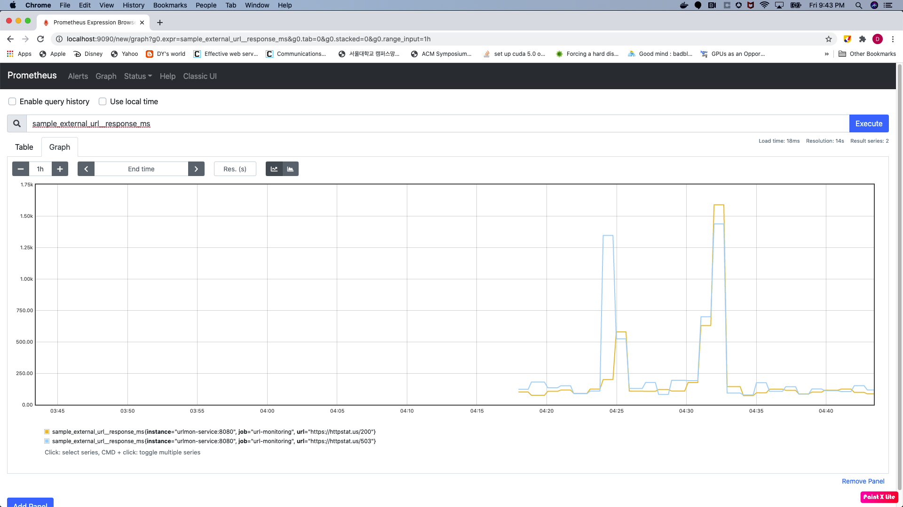

# Grafana Integration
## How to install Grafana
```BASH
kubectl -n <target namespace> create deployment grafana --image=docker.io/grafana/grafana:5.4.3
deployment.apps/grafana created
```

## How to access to Grafana dashboard
First get Grafana pod name
```BASH
kubectl get pods -n <target namespace>
NAME                                            READY   STATUS      RESTARTS   AGE
client-job-1603515180-zsvd6                     0/1     Completed   0          4m59s
client-job-1603515240-zrvbd                     0/1     Completed   0          3m59s
client-job-1603515300-6vv7v                     0/1     Completed   0          2m59s
client-job-1603515360-qdpm6                     0/1     Completed   0          119s
client-job-1603515420-fjslh                     0/1     Completed   0          59s
grafana-d7bd666bc-r2dpl                         1/1     Running     0          94s
prometheus-alertmanager-6b64586d49-xtwbs        2/2     Running     0          42m
prometheus-kube-state-metrics-c65b87574-4567g   1/1     Running     0          71m
prometheus-node-exporter-btwbj                  1/1     Running     0          71m
prometheus-pushgateway-7d5f5746c7-mqzb6         1/1     Running     0          42m
prometheus-server-f8d46859b-t2mnv               2/2     Running     0          41m
urlmon-64c99b957f-nbktx                         1/1     Running     0          35m
```
Port-forward to the Grafana pod via 3000
```BASH
kubectl port-forward grafana-d7bd666bc-r2dpl 3000 -n <target namespace>
```

## How to create a simple graph Grafana dashboard
1. Add DataSource
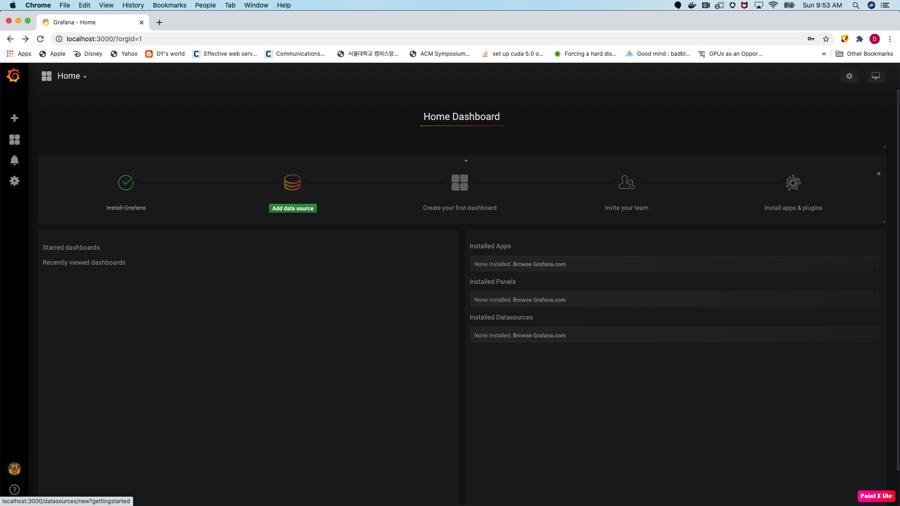
2. Configure Prometheus
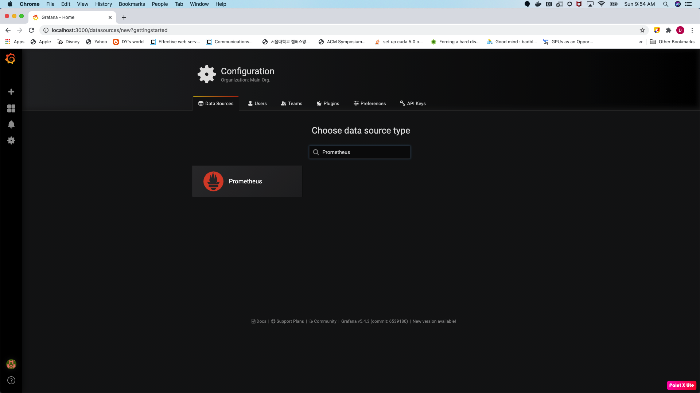
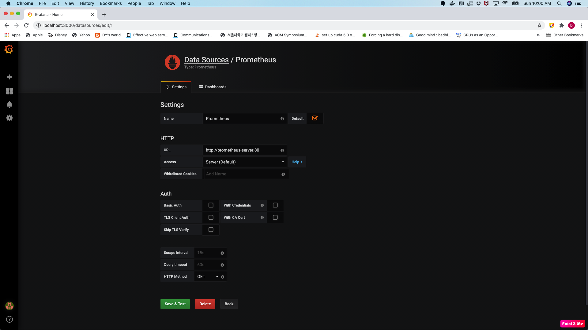
You need to select **http://prometheus-server:80** in HTTP:URL because Prometheus Kubernetes service and port are **prometheus-server** and **80** respectively and Prometheus and Grafana are installed in same namespace. 
3. Click Dashboards -> Manage
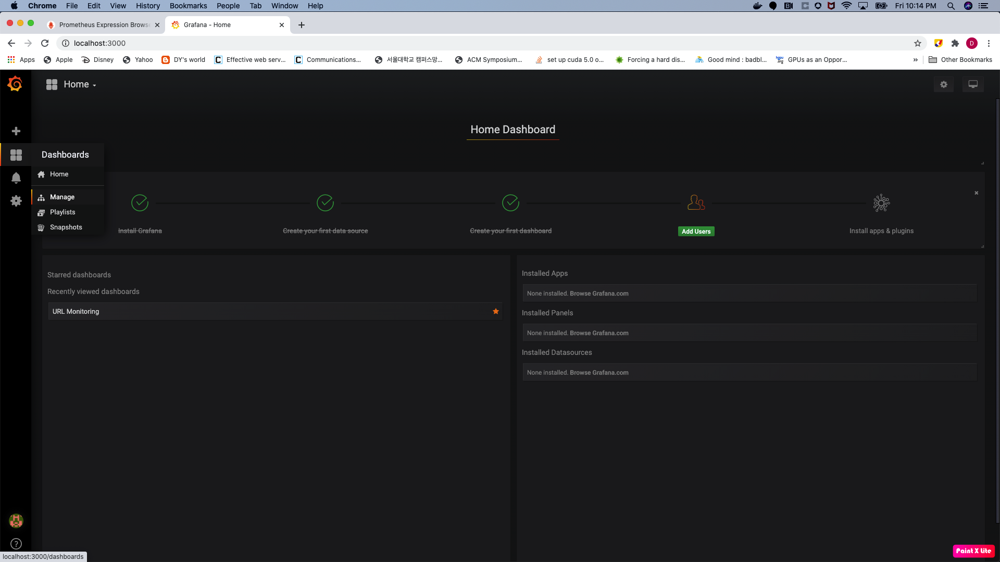
4. Add Dashboard
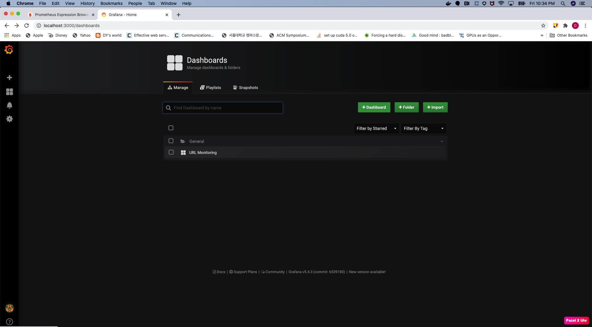
5. Add Graph
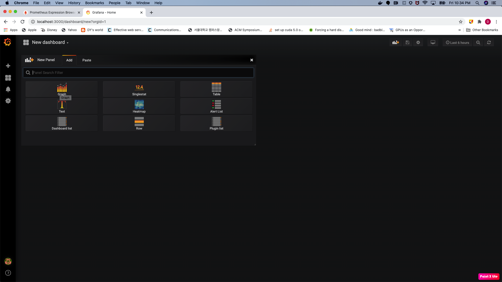
6. Add/Edit Panel
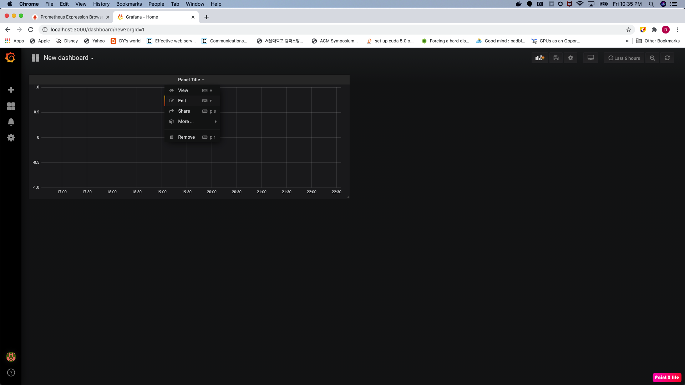
7. Select Prometheus as Data Source and put **sample_external_url__up**
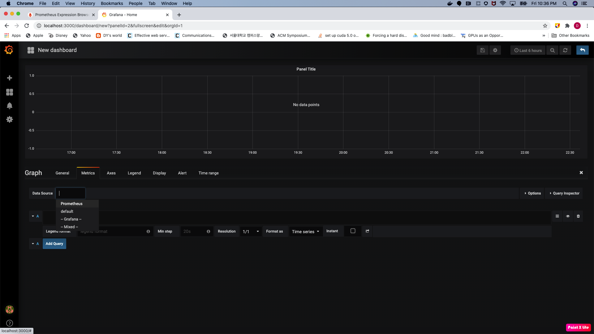
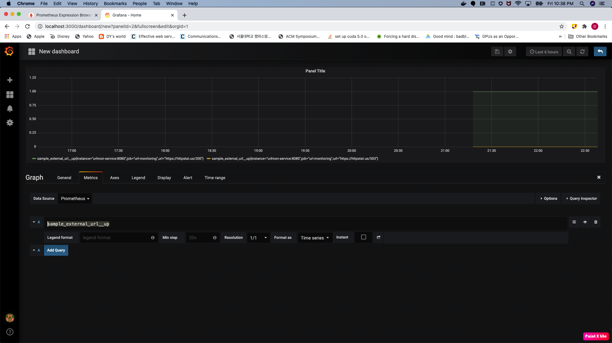
8. Add/Edit Panel one more
9. Select Prometheus as Data Source and put **sample_external_url__response_ms**

# Final result
**sample_external_url__up** and **sample_external_url__response_ms** metrics are visualized at **Grafana** per URL in a timeline manner.  
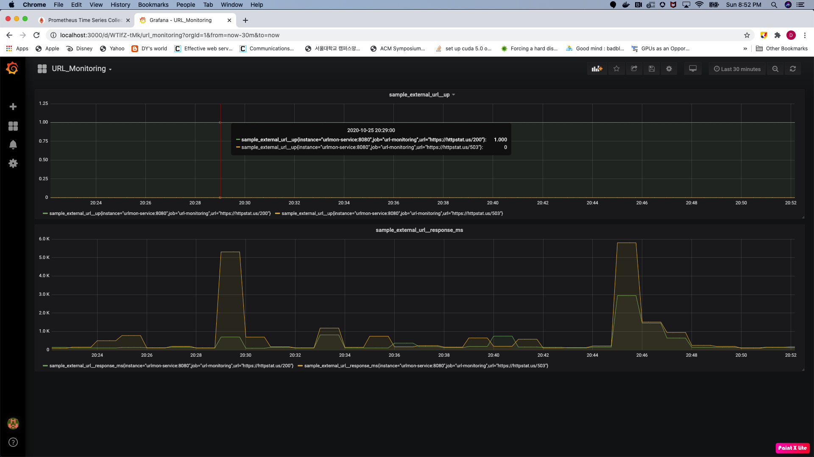
