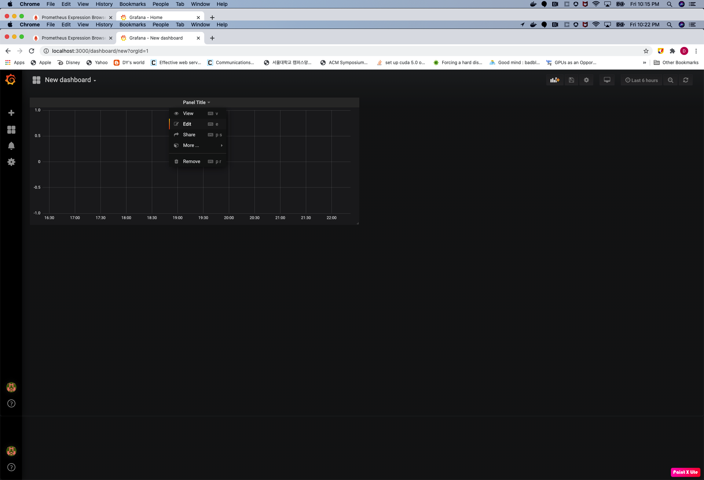
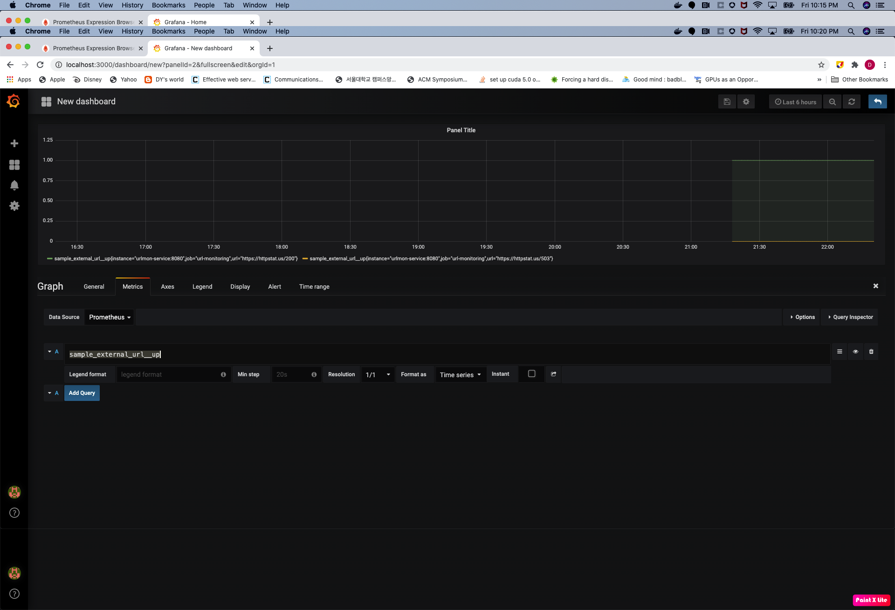
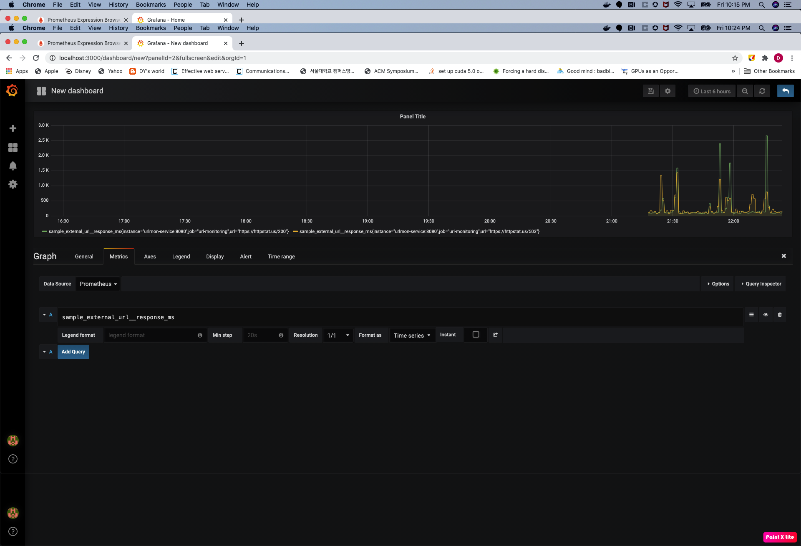

# Author: Dongyou James Seo
Linkedin: https://www.linkedin.com/in/dongyou-james-seo

# URL-Monitoring
## Description
Simple python webserver which has one path **/metrics** and collect URL availability and response time(ms). \
**GET /metrics**: collect availability, UP(1) or DOWN(0), and URL response time in Prometheus format like this:
```BASH
sample_external_url__up{url="https://httpstat.us/503"} 0.0
sample_external_url__response_ms{url="https://httpstat.us/503"} 155.116
sample_external_url__up{url="https://httpstat.us/200"} 1.0
sample_external_url__response_ms{url="https://httpstat.us/200"} 93.34
```

## Prerequisites
Please prepare the below prerequisites before start.
1. python3
2. jsonnet
3. kubectl
4. pip packages
```BASH
pip install -r requirements.txt
```

## How to run unittests
It simply verifies classes one by one.
NOTE: In case of Collector and HTTPConnector classes, it sets up a mock server and the test cases actually uses the classes to access the mock server and collect metrics.  
```BASH
python -m unittest discover -v
test_collectFromWrongURL (test.test_collector.TestCollector) ... 2020-10-23 19:01:03,589         [DEBUG | http_connector.py:23] > GET http://localhost:9999/404
127.0.0.1 - - [23/Oct/2020 19:01:04] "GET /404 HTTP/1.1" 404 -
ok
/Library/Developer/CommandLineTools/Library/Frameworks/Python3.framework/Versions/3.7/lib/python3.7/unittest/suite.py:107: ResourceWarning: unclosed <socket.socket fd=4, family=AddressFamily.AF_INET, type=SocketKind.SOCK_STREAM, proto=0, laddr=('127.0.0.1', 9999)>
  for index, test in enumerate(self):
ResourceWarning: Enable tracemalloc to get the object allocation traceback
test_collectSuccessfully (test.test_collector.TestCollector) ... 2020-10-23 19:01:04,613         [DEBUG | http_connector.py:23] > GET http://localhost:9999/200
127.0.0.1 - - [23/Oct/2020 19:01:06] "GET /200 HTTP/1.1" 200 -
2020-10-23 19:01:06,618          [DEBUG | collector.py:35] > HTTP Status (200) and elapsedTime (2003.506 ms) 
2020-10-23 19:01:06,618          [DEBUG | collector.py:49] > Collecting done
2020-10-23 19:01:06,618          [DEBUG | http_connector.py:23] > GET http://localhost:9999/503
127.0.0.1 - - [23/Oct/2020 19:01:07] "GET /503 HTTP/1.1" 503 -
2020-10-23 19:01:07,627          [DEBUG | collector.py:35] > HTTP Status (503) and elapsedTime (1007.254 ms) 
2020-10-23 19:01:07,627          [DEBUG | collector.py:49] > Collecting done
ok
/Library/Developer/CommandLineTools/Library/Frameworks/Python3.framework/Versions/3.7/lib/python3.7/unittest/suite.py:84: ResourceWarning: unclosed <socket.socket fd=4, family=AddressFamily.AF_INET, type=SocketKind.SOCK_STREAM, proto=0, laddr=('127.0.0.1', 9999)>
  return self.run(*args, **kwds)
ResourceWarning: Enable tracemalloc to get the object allocation traceback
test_getTargets (test.test_config.TestConfig) ... ok
testAccessToMockserver (test.test_http_connector.TestHttpConnector) ... 2020-10-23 19:01:08,135          [DEBUG | http_connector.py:23] > GET http://localhost:9999/200
127.0.0.1 - - [23/Oct/2020 19:01:09] "GET /200 HTTP/1.1" 200 -
2020-10-23 19:01:09,145          [DEBUG | http_connector.py:23] > GET http://localhost:9999/503
127.0.0.1 - - [23/Oct/2020 19:01:10] "GET /503 HTTP/1.1" 503 -
ok
test_getLogger (test.test_utils.TestUtils) ... ok
test_retouch (test.test_utils.TestUtils) ... ok

----------------------------------------------------------------------
Ran 6 tests in 7.069s

OK
```

## How to locally run urlmon for debug purpose
1. Prepare config.json
```JSON
{
	"TARGETS": [
	    "<any URL1 like https://httpstat.us/503>",
	    "<any URL2 like https://httpstat.us/200>",
        ...
    ]
}
```
2. Export CONFIG_PATH
```BASH
export CONFIG_PATH=config.json
```

3. Run main python file
```BASH
python src/url_mon.py <target port> 

In different terminal, 
curl -XGET http://localhost:8080/metrics

For example,
python src/url_mon.py 8080
2020-10-23 21:49:09,055          [INFO | url_mon.py:53] > Serving on port 8080...
2020-10-23 21:49:17,458          [INFO | url_mon.py:25] > Start collecting metrics
2020-10-23 21:49:17,459          [DEBUG | http_connector.py:23] > GET https://httpstat.us/503
2020-10-23 21:49:17,592          [DEBUG | collector.py:35] > HTTP Status (503) and elapsedTime (119.098 ms) 
2020-10-23 21:49:17,593          [DEBUG | collector.py:49] > Collecting done
2020-10-23 21:49:17,593          [DEBUG | http_connector.py:23] > GET https://httpstat.us/200
2020-10-23 21:49:17,736          [DEBUG | collector.py:35] > HTTP Status (200) and elapsedTime (137.867 ms) 
2020-10-23 21:49:17,736          [DEBUG | collector.py:49] > Collecting done
2020-10-23 21:49:17,736          [DEBUG | url_mon.py:43] > Successfully collected [b'# HELP sample_external_url__up Availability, UP or DOWN\n# TYPE sample_external_url__up gauge\nsample_external_url__up{url="https://httpstat.us/503"} 0.0\n# HELP sample_external_url__response_ms Elapsed Time(MS)\n# TYPE sample_external_url__response_ms gauge\nsample_external_url__response_ms{url="https://httpstat.us/503"} 119.098\n', b'# HELP sample_external_url__up Availability, UP or DOWN\n# TYPE sample_external_url__up gauge\nsample_external_url__up{url="https://httpstat.us/200"} 1.0\n# HELP sample_external_url__response_ms Elapsed Time(MS)\n# TYPE sample_external_url__response_ms gauge\nsample_external_url__response_ms{url="https://httpstat.us/200"} 137.867\n']
127.0.0.1 - - [23/Oct/2020 21:49:17] "GET /metrics HTTP/1.1" 200 654
``` 

## How to build docker
```BASH
docker buld -t <imageName>:<any tag> ./

For example, 
docker build -t test-image-42:vmware ./
Sending build context to Docker daemon  16.15MB
Step 1/5 : FROM python:3.7-slim
 ---> 217e85391449
Step 2/5 : WORKDIR /app
 ---> Using cache
 ---> 09c6ebf72cda
Step 3/5 : COPY src/ .
 ---> Using cache
 ---> 91dad9105ea9
Step 4/5 : COPY requirements.txt .
 ---> Using cache
 ---> 6cf40818a4e8
Step 5/5 : RUN pip install -r requirements.txt
 ---> Using cache
 ---> 65dafa3bc2c9
Successfully built 65dafa3bc2c9
Successfully tagged test-image-42:vmware
```
If you wanna push the image into docker hub and use it in non-local Kubernetes.
```BASH
docker login
docker tag <imageName>:<any tag> <your account name>/<imageName>:<any tag>
docker push <your account name>/<imageName>:<any tag>
```

## How to generate kubernetes manifest
To generate the manifest, we need to define the below ones in Jsonnet command.
1. namespace
2. number of replicas
3. target port number
4. image built in previous section: \<imageName\>:\<any tag\>
```BASH
jsonnet urlmon.jsonnet --ext-str namespace=<namespace> --ext-str replicas=<number of replicas> --ext-str port=<target port number> --ext-str image=<the image> > <k8s manifest name>.json

For example,
jsonnet urlmon.jsonnet --ext-str namespace=url-monitoring --ext-str replicas=1 --ext-str port=8080 --ext-str image=solver1318/test-image-42:vmware > k8s.json
```

## How to deploy
```BASH
kubectl apply -f <k8s manifest JSON file path>

For example,
kubectl apply -f k8s.json
```

## Description
After **How to deploy**, you deployed total 5 K8s resources.
1. Namespace: your target namespace
2. Deployment: urlmon : urlmon backend deployment
3. Service: urlmon-service : internal load balancer and redirect traffics to urlmon pod(s) 
4. ConfigMap: urlmon-config : configuration which includes target URLs
5. CronJob: client-job : Client Cronjob which accesses to http://urlmon-service:8080/metrics every 1min and receives the metrics

```BASH
kubectl get pods -n url-monitoring
NAME                          READY   STATUS      RESTARTS   AGE
client-job-1603505940-dzn5k   0/1     Completed   0          4m37s
client-job-1603506000-zlrwk   0/1     Completed   0          3m37s
client-job-1603506060-bmpkb   0/1     Completed   0          2m37s
client-job-1603506120-db6rr   0/1     Completed   0          97s
client-job-1603506180-xlncc   0/1     Completed   0          37s
urlmon-64c99b957f-ttkl7       1/1     Running     0          29m

kubectl logs -f client-job-1603506180-xlncc -n url-monitoring
sample_external_url__up{url="https://httpstat.us/503"} 0.0
sample_external_url__response_ms{url="https://httpstat.us/503"} 282.474
sample_external_url__up{url="https://httpstat.us/200"} 1.0
sample_external_url__response_ms{url="https://httpstat.us/200"} 191.151
```

# Prometheus Integration
## How to install Prometheus through Helm
```BASH
helm repo add stable https://kubernetes-charts.storage.googleapis.com
helm repo update
helm install prometheus stable/prometheus -n <target namespace>

For example,
kubectl get pods -n url-monitoring

kubectl get pods -n url-monitoring
NAME                                            READY   STATUS      RESTARTS   AGE
client-job-1603513200-9d7m4                     0/1     Completed   0          4m54s
client-job-1603513260-sv8zq                     0/1     Completed   0          3m54s
client-job-1603513320-vvsn9                     0/1     Completed   0          2m53s
client-job-1603513380-rbjsd                     0/1     Completed   0          113s
client-job-1603513440-k7wwf                     0/1     Completed   0          53s
prometheus-alertmanager-6b64586d49-xtwbs        2/2     Running     0          9m2s
prometheus-kube-state-metrics-c65b87574-4567g   1/1     Running     0          38m
prometheus-node-exporter-btwbj                  1/1     Running     0          38m
prometheus-pushgateway-7d5f5746c7-mqzb6         1/1     Running     0          9m1s
prometheus-server-f8d46859b-t2mnv               2/2     Running     0          7m58s
urlmon-64c99b957f-nbktx                         1/1     Running     0          2m11s
```

## How to access Prometheus Alert Manger console
Execute port-forward to connect Prometheus from local to Kubernetes cluster 
```BAsh
export POD_NAME=$(kubectl get pods --namespace <target namespace> -l "app=prometheus,component=server" -o jsonpath="{.items[0].metadata.name}")
kubectl --namespace url-monitoring port-forward $POD_NAME 9090
Forwarding from 127.0.0.1:9090 -> 9090
Forwarding from [::1]:9090 -> 9090
```
Open http://localhost:9090 in your browser 


## How to add urlmon GET /metrics in Prometheus
Update prometheus-server configMap using kubectl edit
```
kubectl edit cm prometheus-server -n <target namespace>
...BASH
    - job_name: prometheus
      static_configs:
      - targets:
        - localhost:9090
    - job_name: url-monitoring # Append url-monitoring job
      static_configs:
      - targets:
        - urlmon-service:8080
```
Check if url-monitoring is added in Prometheus target


Check if **sample_external_url__up** and **sample_external_url__response_ms** are added in Graph like this


# Grafana Integration
## How to install Grafana
```BASH
kubectl -n url-monitoring create deployment grafana --image=docker.io/grafana/grafana:5.4.3
deployment.apps/grafana created
```

## How to access to Grafana dashboard
1. First get grafana pod name
```BASH
kubectl get pods -n url-monitoring
NAME                                            READY   STATUS      RESTARTS   AGE
client-job-1603515180-zsvd6                     0/1     Completed   0          4m59s
client-job-1603515240-zrvbd                     0/1     Completed   0          3m59s
client-job-1603515300-6vv7v                     0/1     Completed   0          2m59s
client-job-1603515360-qdpm6                     0/1     Completed   0          119s
client-job-1603515420-fjslh                     0/1     Completed   0          59s
grafana-d7bd666bc-r2dpl                         1/1     Running     0          94s
prometheus-alertmanager-6b64586d49-xtwbs        2/2     Running     0          42m
prometheus-kube-state-metrics-c65b87574-4567g   1/1     Running     0          71m
prometheus-node-exporter-btwbj                  1/1     Running     0          71m
prometheus-pushgateway-7d5f5746c7-mqzb6         1/1     Running     0          42m
prometheus-server-f8d46859b-t2mnv               2/2     Running     0          41m
urlmon-64c99b957f-nbktx                         1/1     Running     0          35m
```
2. Port-forward to the pod
```BASH
kubectl port-forward grafana-d7bd666bc-r2dpl 3000:3000 -n url-monitoring
```

## How to create a simple graph Grafana dashboard
1. Click Dashboards -> Manage

2. Add Dashboard

3. Add Graph

4. Add/Edit Panel

5. Select Data Source = Prometheus and put sample_external_url__up and save

6. Add/Edit Panel one more
7. Select Data Source = Prometheus and put sample_external_url__response_ms and save

8. Check URL Monitoring Dashboard


| panel     | Description |
|-----------|---------------------------------------------------------------|
| sample_external_url__up      | Timeline based URL Availability 0(Down) or 1(Up)|
| sample_external_url__response_ms  | Timeline based URL Response Time(ms) |
